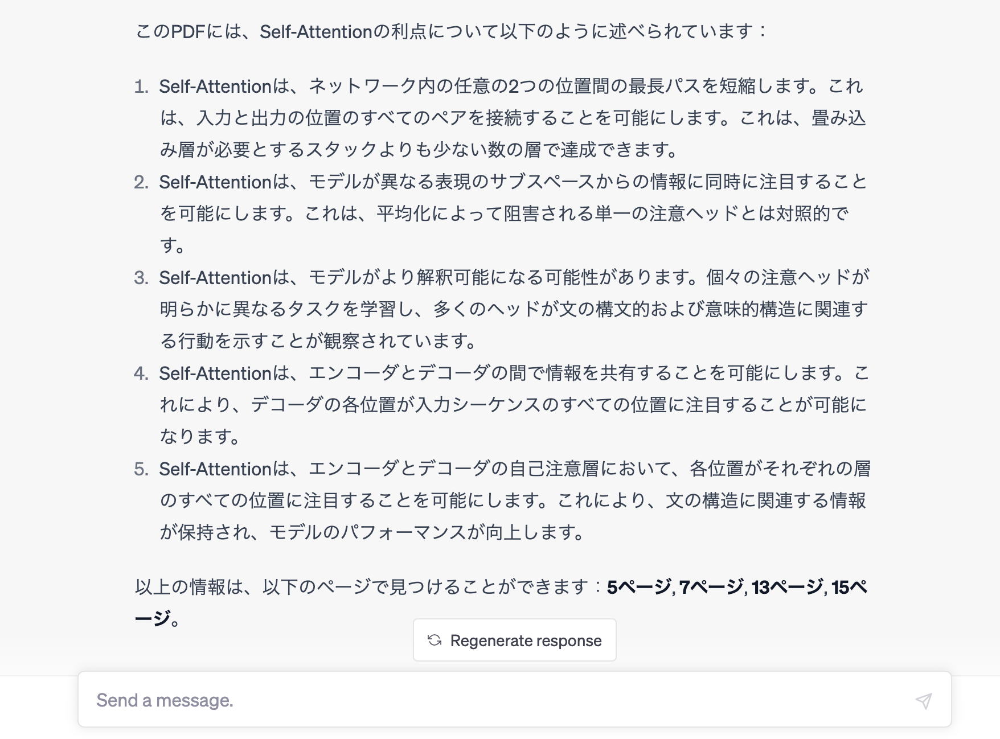

# ChatGPTでPDFの内容を聞く方法 4 選：どれがいいの？
本記事では、ChatGPT を使って PDF ドキュメントの内容を自然言語で問い合わせる方法について紹介します。

比較・評価するのは、筆者が個人的に気になった下記の3つの方法です。

1. ChatGPT と LangChain を組み合わせて使う方法
1. ChatGPT Plus で PDF 対応プラグインを使う方法
1. ChatGPT を使用した PDF チャットサービスを使う方法
1. Microsoft Edge で新しい Bing を使う方法

また、それぞれの方法について、下記の3つの観点から比較・評価します。

1. 始めやすさ
1. 回答のクオリティ
1. 必要な費用

評価は3段階で評価します。⭐️の数が多いほど、筆者が優れていると感じた方法になります。

# 1. ChatGPT と LangChain を組み合わせて使う方法

この方法は、以前にご紹介した下記の記事にあるように、ChatGPT の API と LangChain フレームワークを組み合わせた Python プログラムを作成し、PDF 文書の内容を自然言語で問い合わせできるようにする、といったものです。

https://qiita.com/hiroki_okuhata_int/items/7102bab7d96eb2574e7d

LangChain は、PDF 文書の内容を構造化し、ChatGPT はその構造化されたデータに対して自然言語での問い合わせを可能にします。LangChain と ChatGPT を組み合わせることで、PDF 文書の内容に対して様々な処理が可能になります。

これにより、特定の質問に対する詳細な回答を生成したり、文書全体を要約したり、さらには文書間での情報の比較など、より高度な分析が可能になります。さらに、PDF 文書の中で回答の元となった箇所はどこか？についても確認することができます。

## 始めやすさ ⭐️
ChatGPT と LangChain を組み合わせて使う方法は、Python プログラムを作成して実行する必要があるため、他の2つの方法に比べて始める敷居が高くなります。
ですが、上記の記事にあるように、プログラム自体は短く、Google Colabなどの環境を使うことで、すぐに試すことができます。

## 回答のクオリティ　⭐️
前述の記事で紹介しているような単純な方法ですと、回答のクオリティは高くありません。高度な要約を得るには、テキスト要約用のチェーンを組み合わせる必要があります。

筆者が試してみた限りでは、テキスト要約用のチェーンを組み合わせると、後述する　ChatPDF と同レベルの要約が得られるかな、という感触でした。ですので、テキスト要約チェーンを使用した場合の回答のクオリティは⭐️⭐️です。

LLMを用いた長い文書の要約手法には様々なものが提案されています。LangChainにも複数の要約手法が実装されていますので、PDF文書の長さや特性、質問などに合わせて使い分ける必要があります。

## 必要な費用 ⭐️
ChatGPT の API 利用には無料試用枠があります。また、LangChain は無料で使うことができます。ですが、ChatGPT の API 呼び出しには、単位時間当たりの回数制限があります。テキスト要約処理には多くの API 呼び出しが必要です。この場合、無料試用枠のレート制限では快適に使うことは難しいと思います。このため、API 呼び出しに対する従量課金型の有料アカウント契約を行う必要が出てくるでしょう。

また、Python コードを実行する環境が必要です。ローカル環境でも良いですが、十分なリソースが必要です。Google Colab などを使用することもできますが、こちらも無料プランでは必要なリソースが不足してエラーになってしまう場合がありますので、有料プランが必要になるでしょう。

## その他

### 他のデータと組み合わせたLLMの利用について
この方法では LangChain を使って、PDF ドキュメントの他にも様々なデータを組み合わせて ChatGPT などの LLM を利用することができます。他の方法ではこうした使い方は難しいため、用途によって試してみるとよいでしょう。

### この方法での GPT-4 の利用について
本書執筆時点で、**GPT-4** のAPI利用には waitlist への申請と承認が必要です。

https://openai.com/waitlist/gpt-4-api

GPT-4 の API アクセス権を得ていないと、この方法で GPT-4 を使用することはできません。このため、この方法で使用可能なモデルは、主に **GPT-3.5-turbo** になります。


## 2. ChatGPT Plusで、PDF対応プラグインを使う方法

この方法は、**ChatGPT Plus** のユーザに対して、最近、利用可能になった**プラグイン機能**を利用して PDF 文書の内容を問い合わせる方法です。すでに何十種類ものプラグインが使用可能になっていますが、本記事の執筆時点で、PDF 文書の内容を問い合わせることができるプラグインには下記の２種類があります。

- AskYourPDF
- ChatWithPDF

### 始めやすさ　⭐️
ChatGPT Plus は、OpenAI 社による ChatGPT のための有料のサブスクリプションプランです。この方法を始めるには、まず ChatGPT Plus　に契約して、**Settings** 画面の **Beta features** から **Plugin** を有効にする必要があります。有料のサブスクリプションプランを契約する必要があるため、無料で始められる他の方法に比べると敷居が高いです。


### 回答のクオリティ　⭐️⭐️⭐️
この方法の良い点として、ChatGPT Plus　を契約していると、**GPT-4**　が使えるため、より高度な回答が得られやすいことがあります。```gpt-3.5-turbo``` を使用した場合の1番目の方法よりも、より高度な説明を含んだ回答が得られやすいです。回答の根拠となった箇所を確認することも可能です。




ただし、本記事執筆時点では、GPT-4 に聞けるのは **3 時間あたりで 25 メッセージまで**、という制限があります。

### 必要な費用　⭐️
本記事の執筆時点では、ChatGPT Plus の契約には、**月額　$20**　の費用がかかります。また、筆者が試してみたところ、前述の二つのPDF対応プラグインの使用に対して追加の費用はかからないようでした。

https://openai.com/blog/chatgpt-plus

## その他

### プラグインの利用についての注意点

仕組み上 OpenAI　だけでなく、プラグイン側にも　PDF　文書の内容が共有される点に留意が必要です。また、筆者が試した際には、プラグインによっては、URL で提示した PDF 文書がダウンロードできないため回答できない、といった内容のエラーになったりすることがよくありました。

### 他のプラグインと組み合わせた利用について
ChatGPT Plus　では、PDF 対応プラグインだけでなく、他のプラグインと組み合わせて、ChatGPT に質問することができます。ただし、本記事執筆時点では、一度に組み合わせることができるプラグインの数は **最大で 3 つまで** です。

# 3. ChatGPT を使用した PDF チャットサービスを使う方法

ここでは **ChatPDF** という PDF チャットサービスを紹介します。

https://www.chatpdf.com/

サービスのWebサイトにアクセスし、PDF ファイルをアップロードすると、その PDF に対する質問ができる、といったサービスになります。PDF ファイルのアップロードは、URL で指定したり、ローカルホストにあるファイルをアップロードしたり、といった方法が取れます。


## 始めやすさ ⭐️⭐️
サイトは英語ですが、シンプルな UI であるため、非常に簡単に使い始められます。PDF ファイルをアップロードすると、すぐに簡単な要約を示してくれます。また、内容に関連した質問の例も提示してくれますので、提示された質問をクリックするだけで、PDF 文書の内容の理解を進めることができます。提示される質問の例は英語ですが、日本語で質問することもできます。日本語で質問すると、きちんと日本語で回答が得られます。

## 回答のクオリティ ⭐️⭐️
回答のクオリティは相対的にいうと、テキスト要約チェーンを使わない場合の1番目の方法より高く、3番目・4番目の方法よりも低い、といったところでしょうか。内部的に GPT 3.5 を使用し、質問ごとに関連する数パラグラフから回答を生成している、とFAQに書いてあります。

## 必要な費用 ⭐️⭐️
１日当たり３つの PDF ファイルまで、という制限がありますが、無料で使い始めることができます。筆者は有料プランは試していませんが、有料プランも用意されています。

## その他

### 登録したファイルの扱いについて
登録したファイルは安全に扱われるか？などの質問と回答が **FAQ** に書いてあります。使う前に確認されることをお勧めします。

# 4. Microsoft Edge で新しい Bing を使う方法

## 始めやすさ ⭐️⭐️⭐️
Microsoft Edge の新しい Bing では、チャット機能の中で表示中の PDF 文書の内容について要約を得ることができます。Microsoft アカウントと Microsoft Edge があれば、誰でも簡単に試してみることができるため、始めやすさの点では最も手軽な方法と言えるでしょう。

具体的な始め方は、最新の Microsoft Edge で何かのPDF文書を開き、「このページには何が書かれていますか？」などと問い合わせるだけです。
例えば、arXiv にあるような論文については、「この論文の結論は何ですか？」などと聞くこともできます。

## 回答のクオリティ ⭐️⭐️⭐️
筆者の個人的な感想では、新しい Bing の　PDF 要約の能力は十分に高いと感じました。また、Web から得られる最新の情報や関連する URL などの情報も組み合わせて回答が作成されるため、PDF文書に登場する用語の理解なども早まることが期待できます。このため、単純にひとつの PDF 文書の内容について質問する、最もポピュラーなユースケースでは Bing が最強、という印象を受けました。


## 必要な費用 ⭐️⭐️⭐️
無料で使うことができます。

## その他

あるPDF文書など、ひとつのトピックには続けられる会話の長さに制限があります。「新しいトピック」ボタンを押すことで、新しい会話を始められますが、それまでの会話の内容は記憶されないため、過去のやり取りをもとにした質問はできません。

# まとめ

下表が筆者の個人的な評価結果のまとめです。

||1. ChatGPT + LangChain|2. ChatGPT Plus + Plugins|3. ChatPDF|4. Microsoft Edge + Bing|
|-|-|-|-|-|
|始めやすさ|⭐️|⭐️|⭐️⭐️|⭐️⭐️⭐️|
|回答のクオリティ|⭐️ ... ※|⭐️⭐️⭐️|⭐️⭐️|⭐️⭐️⭐️|
|必要な費用|⭐️|⭐️|⭐️⭐️|⭐️⭐️⭐️|

※ 使用するLLMのモデルやチェーンの内容によって向上する

手軽に始められる、Microsoft Edge で新しい Bing を使う方法が総合的に最も使い勝手がよい、という嬉しい結果になりました。

とはいえ、今回紹介した３つの方法は、それぞれ異なる特性と利点を持っています。例えば、PDF 文書の内容を抽出して表や図を作成する、などの複数のプラグインまたはローダーを組み合わせるようなユースケースでは、1番目や2番目の方法で現在の実用性がどの程度か、試してみる価値があるでしょう。

読者の方には、ぜひご自身で試して頂き、それぞれのニーズに合った方法を探してみてほしいと思います。

なお、本記事の内容は、執筆時点（2023年5月第３週）での情報に基づきます。

AI 領域の進歩の速さは、まさに日進月歩と言えます。今後も新しい機能やサービスの登場が楽しみですね。