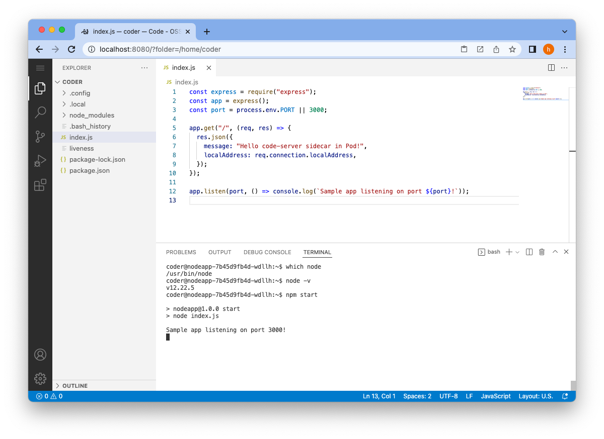
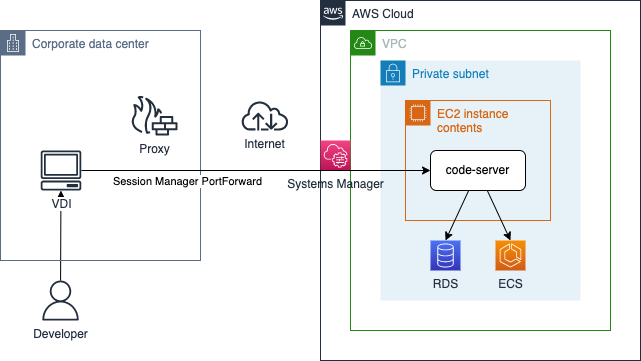
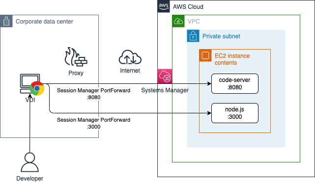
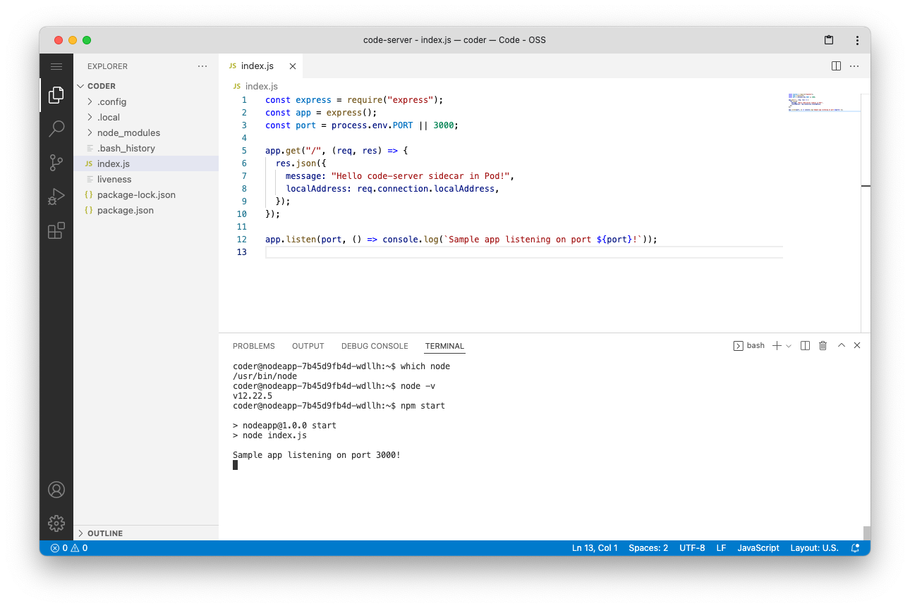

# code-server on EC2 で開発 PC のスペック不足を解消する

code-server, AWS, VSCode

# AWS 上に置いた code-server で開発したら、なかなか快適だった

開発 PC のスペック不足で開発生産性が上がらない問題の対策として code-server を実務に導入したところ、期待通り、なかなか快適な開発環境が実現できたため、簡単ですが、共有いたします。

# code-server とは？

- ひとことで言うと、ブラウザ上で実行できる VS Code です。
  - 参照：[github.com/coder/code-server](https://github.com/coder/code-server)
- 通常の VS Code と完全に同じものではありませんが、後述するように、ほぼ遜色なく使えます。

  

# なぜ code-server を使おうと思ったか？

- ある案件で、開発に使える環境が仮想デスクトップ環境だったのですが、スペックが十分でなく、かつ諸般の事情で引き上げることもできなかったためです。このため、十分なスペックを持つ開発環境を AWS 上に設けたいと思いました。

# なぜ code-server を選択したのか？

- 筆者はこれまで、リモート開発環境については下記のようなものを模索しながら使ってきたのですが、

  - Windows Server + EC2 （リモートデスクトップ接続）
  - Amazon Workspaces
  - Cloud9

  リモートデスクトップ接続における、操作に対するレスポンスがワンテンポ遅れるような感覚だったり、Cloud9 の「自分が使いたいのは VS Code っぽい環境ではなく、VS Code そのものなんだけどな…」などの違和感があり、いまいち決定打に欠ける印象でした。

- そこで以前 code-server を知った時に「探していたのはコレだ！」感があったのと、実際の業務でも必要性が高まってきたため、実務でも code-server を使うことにしました。

# 実際使ってみてどうだったか？

- 実務で使ってみたところ、かなり快適でした。
- code-server の場合、ブラウザと code-server の間でやりとりしている情報は少量のため、筆者の環境では、操作感はリモートデスクトップ接続方式のものより断然よく、ローカルホストで起動した通常の VS Code コードとほぼ変わらない感覚で使えています。
- このため、開発グループ内で仮想デスクトップ環境のスペック不足問題について同じ悩みを持つ他の開発者の方にも紹介し、使ってもらうことにしました。
- 今のところ、特に目立った問題点はなく、快適に使えています。

# 便利な点

筆者の環境ではプロキシを経由する必要から、下記のような構成で使っていますが、後述するようなメリットがあります。

- セッションマネージャのポートフォワーディング接続を使用することで、code-server インスタンスを VPC のプライベートサブネットに配置することができ、パブリックサブネット上に配置して使用するよりも安全に使用することができます。

- VPC 内に code-server を配置することで、同じ VPC 内にある RDS インスタンスや ECS クラスタなどにアクセスしやすくなり、デバッグがしやすくなります。

- code-server を Terraform 作成環境として使う場合も、VPC 内にあることがメリットになります。Terraform を試しに実行する際に、例えば DB ユーザなどを作成する Terraform プロバイダーは、当然ながら DB インスタンスへ接続できるホストから実行することが必要になるからです。

前述のような構成で code-server を使うと、VPC 内の各種 AWS リソースが、あたかもローカル環境のリソースであるように感じるくらいスムーズにアクセスすることができます。これは、ローカルの開発 PC で作成したソースコードをリポジトリ経由でリモートのテスト環境に送り込む必要がない点が大きいと思います。個人的には、とても便利に感じています。

## 上記構成上の注意点

- 例えば、フロントエンドアプリケーションを開発する時など、code-server の EC2 インスタンス上で Node.js などのサーバを起動したくなる場合があります。この場合、ブラウザで動作を確認するためには、code-server とは別にもう一本、セッションマネージャのポートフォワード接続が必要になります。

  

- また、Cypress や Playwright などで、ブラウザを必要とする E2E テストを作成する時にも、code-server インスタンス上でブラウザを起動しても、開発 PC で表示できないことに注意が必要です。このため、code-server インスタンス上でヘッドレス実行するのであれば問題ありませんが、ブラウザを表示しながらのテストシナリオ作成については、基本的にローカルの開発 PC 上で行う必要があります。

- これらはローカルの開発 PC のみの開発に比べ、煩雑になってしまう点ですが、VPC 内リソースに容易にアクセスできる点や、ローカルの開発 PC のリソースに縛られずに、必要に応じて EC2 のマシンスペックを自在に引き上げられる柔軟性を考えると、許容範囲かなと個人的には感じています。

# 通常の vscode と比較した場合に、制約になる点は？

- 公式 FAQ にもあるように、Live Share など、一部利用できないプラグインがあります。ですが、主要なプラグインの多くは、[open-vsx.org](https://open-vsx.org) に公開されている印象なので、個人的には問題なく使えています。

  [Why can't code-server use Microsoft's extension marketplace?](https://coder.com/docs/code-server/latest/FAQ#why-cant-code-server-use-microsofts-extension-marketplace)

- 筆者が利用したバージョンでは、GUI 上でキーボードショットカットのカスタマイズをしようとしてもエラーになり、カスタマイズができませんでしたが、keybindings.json を直接編集し、Reload Window することで、問題なくキーボードショートカットのカスタマイズができました。

# コストは？

- code-server は、1 台の EC2 インスタンスに複数個立ち上げることができます。このため、1 台の EC2 インスタンスを複数人で共有して使うことができます。

- この点をうまく活用すると、1 ユーザごとに占有リソースを割り当てるタイプのサービスである Amazon Workspaces よりも、だいぶ割安になります。また、同じ理由で、追加ライセンスを購入しないと最大同時セッション数が少ない Windows Server を EC2 インスタンスで利用する方式と比べても、だいぶ割安になります。

# 通常の VS Code と遜色なく使うには？

- Chrome 上で code-server を使う場合、Chrome のデフォルトショートカットキーを抑止するプラグインを導入すれば、ショートカットキーの競合を気にせず使うことができます。

  [https://github.com/google/disable-keyboard-shortcuts](https://github.com/google/disable-keyboard-shortcuts)

- Chrome のタブ上で表示させた code-server は、Chrome のプログレッシブウェブアプリ（PWA）としてダウンロードすることができます。PWA とすることで、Chrome のアドレスバーやメニューバーなしで表示できるため、見た目も通常の VS Code とほぼ変わりなく使用できます。

  

# まとめ

- code-server は見た目も操作感も、通常の VS Code と区別がつきにくいくらい、遜色なく使うことができます。
- AWS + code-server の組み合わせは、AWS の VPC 内リソースが、あたかもローカルリソースであるかのような感覚でアクセスすることができるようになり、開発生産性が高まります。
- 開発 PC のスペック不足に悩まされていない方も、ぜひ一度使ってみることをお勧めします。新しい活用法が得られるかもしれません。

# 記事の続き

内容の続きは、こちらの記事「[code-server で in-Cluster ＆ in-Pod な Kubernetes のマイクロサービス開発スタイルを実現する(1/2)](../code-server-on-kubernetes/code-server-on-kubernetes-part1.md)」をご参照ください。
