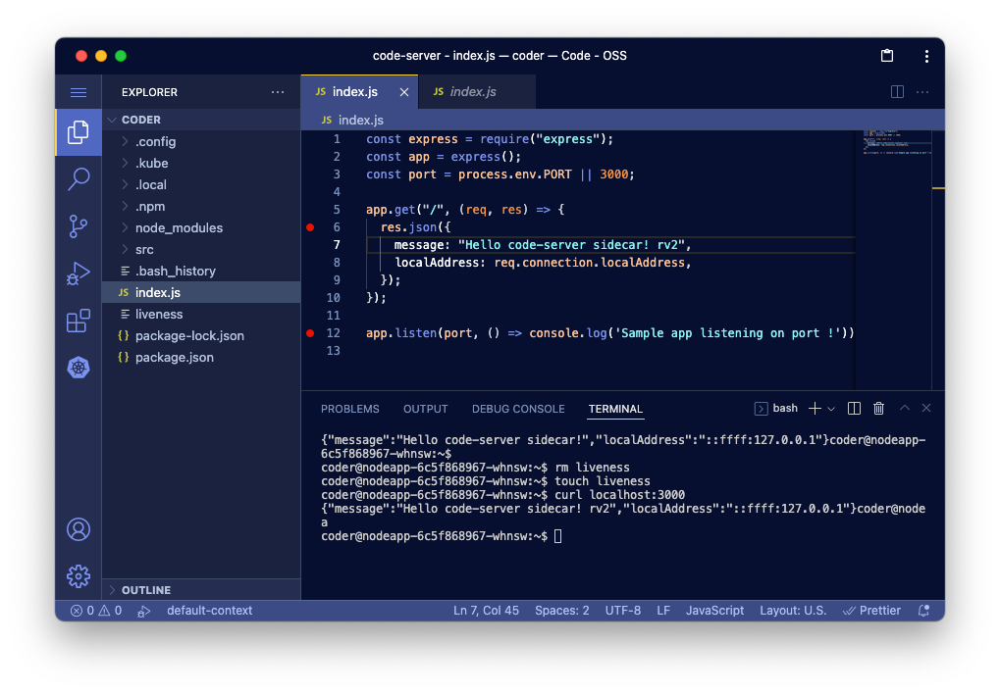
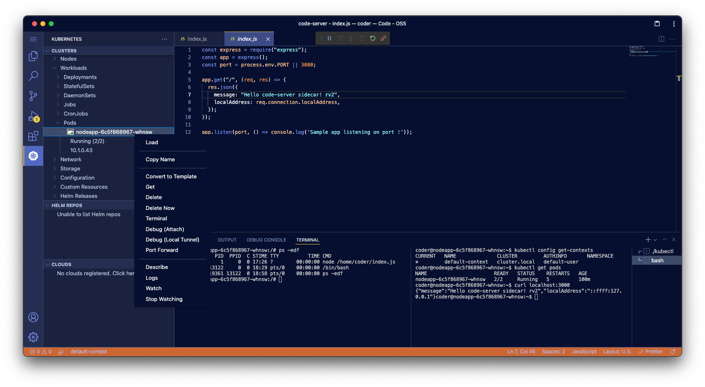
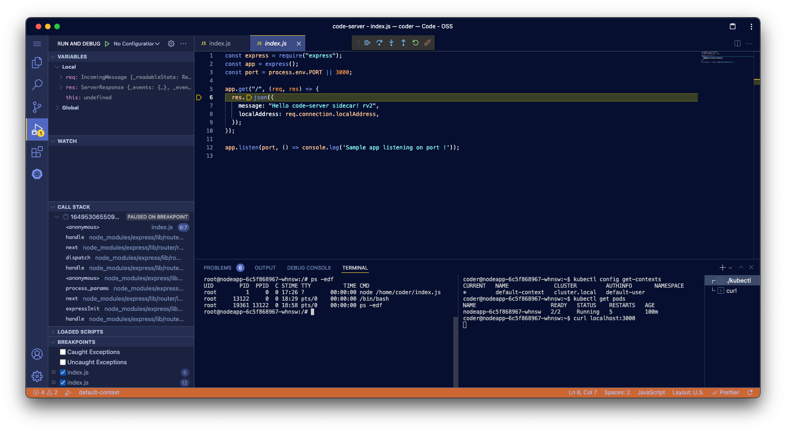

# Kubernetes 上の code-server で Pod やメインコンテナにアタッチしてデバッグする

kubernetes TelePresence Remote-Containers code-server VSCode

# code-server とは？

- ひとことで言うと、ブラウザ上で実行できる VS Code です。
  - 参照：[github.com/coder/code-server](https://github.com/coder/code-server)
- 通常の VS Code と完全に同じものではありませんが、ほぼ遜色なく使えます。

  

- 過去記事もご参照ください。
  - [code-server on EC2 で開発 PC のスペック不足を解消する](../code-server-on-ec2/code-server-on-ec2.md)
  - [code-server で in-Cluster ＆ in-Pod な Kubernetes のマイクロサービス開発スタイルを実現する(1/2)](code-server-on-kubernetes-part1.md)
  - [code-server で in-Cluster ＆ in-Pod な Kubernetes のマイクロサービス開発スタイルを実現する(2/2)](code-server-on-kubernetes-part2.md)
- 前回の記事で触れましたように、code-server を Kubernetes クラスタで in-Cluster & in-Pod に活用することで、Kubernetes のマイクロサービス開発を容易にすることができます。
- 今回はその続編として、Kubernetes 上に立てた code-server で、Pod へアタッチしてデバッグする方法についても、ご紹介しようと思います。

# Kubernetes 上の code-server の魅力をもう少し掘ってみた

[前回](https://qiita.com/hiroki_okuhata_int/items/485f840218f1032b357b) ご紹介した、in-Cluster & in-Pod な code-server を使って開発すると、他の Pod や同じ Pod のメインコンテナにアタッチして、ブレークポイントで止めたりするようなデバッグがしたくなると思います。

これができると、通常の VS Code の `Remote-Containers` 拡張機能と `Kubernetes` 拡張機能の組み合わせや、Telepresence のような、よくできた、すでにある他の方法と肩を並べるくらい魅力的になると言えるでしょう。

では、どうやったら可能になるでしょうか？

# Kubernetes 上の code-server で in-Cluster & in-Pod なデバッグを可能にする方法

## まずは code-server に kubectl と helm をインストールする

code-server は、Debian ベースのコンテナになっていますので、下記のようなコマンドで `kubectl` をインストールします。

    ```
    sudo apt-get update && sudo apt-get install -y apt-transport-https gnupg2
    curl -s https://packages.cloud.google.com/apt/doc/apt-key.gpg | sudo apt-key add -
    echo "deb https://apt.kubernetes.io/ kubernetes-xenial main" | sudo tee -a /etc/apt/sources.list.d/kubernetes.list
    sudo apt-get update
    sudo apt-get install -y kubectl
    kubectl version

    curl https://raw.githubusercontent.com/helm/helm/main/scripts/get-helm-3 | bash
    helm version
    ```

## .kube/config ファイルがなくても、すでに default サービスアカウントで何でもできる

- code-server 自体は、すでに Kubernetes の default 名前空間で起動している Pod の中のサイドカーコンテナですので、default サービスアカウントの権限で動作しています。
- すべての Pod は、自分自身を起動しているサービスアカウントの認証トークンで Kubernetes の API サーバーと通信していますので、この権限を使って kubectl コマンドが使えるはずです。
- 下記のようなコマンドで確かめてみましょう。

  ```
  # 全ての名前空間の Pod の一覧が見れることを確認する
  kubectl get pods -A

  # busybox でシェルを立ち上げる
  kubectl run --rm -i --tty busybox --image=busybox -- sh
  ```

- 下記が実行結果例になります。

  全ての名前空間の読み取りができているようです。

  ```
  coder@nodeapp-6c5f868967-whnsw:~$ kubectl get pods -A
  NAMESPACE     NAME                                     READY   STATUS    RESTARTS   AGE
  default       nodeapp-6c5f868967-whnsw                 2/2     Running   5          124m
  kube-system   coredns-558bd4d5db-qb5hs                 1/1     Running   1          51d
  kube-system   coredns-558bd4d5db-xrdfz                 1/1     Running   1          51d
  kube-system   etcd-docker-desktop                      1/1     Running   1          51d
  kube-system   kube-apiserver-docker-desktop            1/1     Running   1          51d
  kube-system   kube-controller-manager-docker-desktop   1/1     Running   1          51d
  kube-system   kube-proxy-gmknh                         1/1     Running   1          51d
  kube-system   kube-scheduler-docker-desktop            1/1     Running   20         51d
  kube-system   storage-provisioner                      1/1     Running   19         51d
  kube-system   vpnkit-controller                        1/1     Running   593        51d
  coder@nodeapp-6c5f868967-whnsw:~$
  ```

  kube-system 名前空間でも、新たな Pod を起動することができました。

  ```
  coder@nodeapp-6c5f868967-whnsw:~$ kubectl run -n kube-system --rm -i --tty busybox --image=busybox -- sh
  If you don't see a command prompt, try pressing enter.
  / # echo hello, code-server-sidecar in kube-system namespace.
  hello, code-server-sidecar in kube-system namespace.
  / # exit
  Session ended, resume using 'kubectl attach busybox -c busybox -i -t' command when the pod is running
  pod "busybox" deleted
  coder@nodeapp-6c5f868967-whnsw:~$
  ```

## .kube/config ファイルなしでは `Kubernetes` 拡張機能は使えない

- 上記の後、code-server に `Kubernetes` 拡張機能をインストールしてみましたが、Kubernetes クラスタを認識しませんでした。おそらく `.kube/config` ファイルがないためだろうと想定できます。

- ここでは、default サービスアカウントの認証トークンの情報で、`.kube/config` ファイルを作ってみたいと思います。

### default サービスアカウントで `.kube/config` ファイルを作成する

```
# default サービスアカウントの認証トークン（default-token-xxxxx）を特定します。
kubectl get sa
kubectl get secret

# 特定した認証トークンの内容を確認し、BASE64 デコードした値を保存します。
kubectl get secret default-token-xxxxx -o yaml
TOKEN=$(kubectl get secret default-token-xxxxx -o jsonpath='{.data.token}' | base64 -d)
echo $TOKEN

# デコードした認証トークンで default-user という名前ユーザを作成します。
kubectl config set-credentials default-user --token=$TOKEN

# .kube/config ファイルが作成されたことを確認します。
ls -l .kube/
cat .kube/config

# 現在の Kubernetes クラスタで default-context という名前のコンテキストを作成します。
# 先ほど作成した、default-user のコンテキストに設定します。
kubectl config set-context default-context --user=default-user
kubectl config set-context default-context --cluster=cluster.local
cat .kube/config

# 作成した default-context を現在のカレントコンテキストに設定します。
kubectl config use-context default-context
kubectl config get-contexts

# 念のため、再び何でもできることを確認します
kubectl get pods -A
kubectl run -n kube-system --rm -i --tty busybox --image=busybox -- sh
```

### `kubernetes`拡張機能で、Pod の一覧が見れるようになったことを確認する

- 前述の方法で　`.kube/config` ファイルを作成できたことで、`Kubernetes` 拡張機能が Kubernetes クラスタを認識できるようになり、Pod の一覧が表示できるようになったことが確認できました。

  

- これで他の Pod や同じ Pod 内の他のコンテナにアタッチしてデバッグすることができます。

### code-server サイドカーから、同じ Pod のメインコンテナにアタッチしてデバッグしてみる

- 前項までで他の Pod にアタッチしてデバッグできるようになりましたが、ここでは code-server サイドカーを使って、同じ Pod 内のメインコンテナにアタッチしてデバッグしてみたいと思います。
- それでは、「`Debug (Attach)`」メニューを選んで Pod にアタッチし、アプリケーションコードにブレークポイントを置いてみましょう。

- ブレークポイントが置けたら、curl でメインコンテナを叩いてみます。

  ```
  curl localhost:3000
  ```

- 期待通り、ブレークポイントで止まりました！

  

- これで、code-server サイドカー方式でも、`Kubernetes` 拡張機能をつかって、Pod にアタッチしてデバッグできることが確認できました。

# まとめ

- Kubernetes クラスタ上に立てた code-server も、通常の VS Code と同様に、Pod やメインコンテナにアタッチしてデバッグできることが分かりました。
- 特に code-server サイドカー方式では、サイドカーコンテナで起動している code-server が、同じ Pod の中のメインコンテナにアタッチしてデバッグしている、という、非常に興味深い方式である点が、ポイント高いです。
- また、in-Cluster & in-Pod な code-server では、よくできた他の方式と比べ、特に複雑なことをしているわけではなく、最初から Kubernetes クラスタの中や、Pod の中にいるため、比較的シンプルなことしかしていないのに、他と同じようなことができている、という点も興味深いです。
- リモートデバッグならぬ、in-Cluster デバッグ、または in-Pod デバッグ！ということで、code-server が切り開いた、IDE Anywhere な世界らしいデバッグ方式です。
- これで、VS Code の `Remote-Containers` + `Kubernetes` 拡張機能や、Telepresence などの他の方式による開発やデバッグの方式と、肩を並べたといっても良いかもしれません。
- code-server にしかないメリットも見つかりそうですので、まだまだ掘ってみる価値がありそうです。興味を持ったあなたも、ぜひ掘ってみてはいかがでしょうか？
