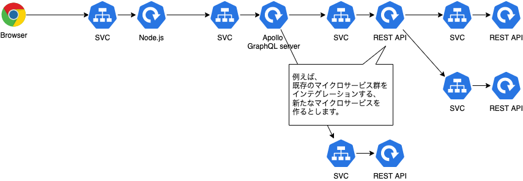
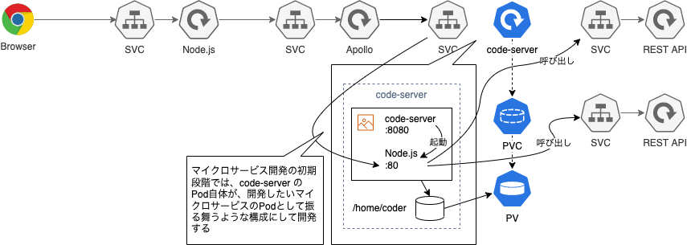
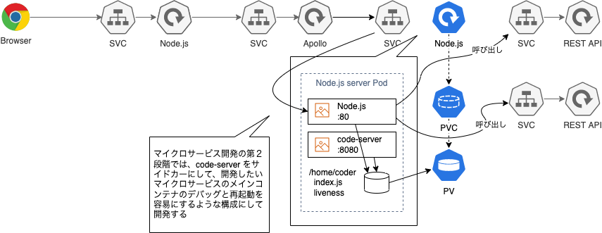
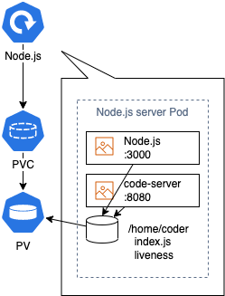

# code-server で in-Cluster ＆ in-Pod な Kubernetes のマイクロサービス開発スタイルを実現する(1/2)

kubernetes TelePresence Remote-Containers code-server VSCode

# code-server とは？

- ひとことで言うと、ブラウザ上で実行できる VS Code です。
  - 参照：[github.com/coder/code-server](https://github.com/coder/code-server)
- 通常の VS Code と完全に同じものではありませんが、ほぼ遜色なく使えます。
- 過去記事もご参照ください。
  - [code-server on EC2 で開発 PC のスペック不足を解消する](../code-server-on-ec2/code-server-on-ec2.md)
- 今回は、上記の後編として、code-server の別の活用方法について、ご紹介しようと思います。

  

# code-server で Kubernetes のマイクロサービス開発を容易にする

- 以前、はじめて code-server の存在を知った時に、 **「コレって Pod 上で使ったら、最初から Kubernetes クラスタ内でマイクロサービス開発できるのでは！？」** と思ったことがありました。
- 実際使ってみたら、期待通りの便利さと可能性を感じましたので、簡単ですが共有いたします。

## Kubernetes で in-Cluster & in-Pod な マイクロサービス開発ができると何が嬉しいのか？

### テスト環境にある既存マイクロサービス群を使って、最初から結合しながら開発できる

- あなたは Kubernetes 上でマイクロサービスを開発する立場だとしましょう。
- あなたが開発するマイクロサービスは、既存のマイクロサービス群の上に作るものだとします。

  

- テスト環境の Kubernetes クラスタ上には、既存のマイクロサービスが、多数デプロイされています。

- 通常ですと、新しいマイクロサービスを開発する時、既存のマイクロサービスの API 仕様に基づいたモック群などを使ってローカルの開発 PC 上で開発するかもしれません。
- しかし、 **モックではなく、最初から本物を使って開発できたら効率的なのに、** と思ったことはないでしょうか？
- もちろんモックでないと通しにくい異常系のテストケースもあると思いますので、モックの必要性がなくなるわけではありませんが、もし、結合テスト用の Kubernetes クラスタの中で、 **最初から本物の既存マイクロサービス群を使って開発できたら、開発作業自体が結合テストそのもの** になりますし、 **デバッグのサイクルも短く、開発が非常に効率的** になります。

### コンテナイメージを再ビルド・再デプロイせず、即反映できる

- Kubernetes の Pod 上で動かすのはコンテナなので、通常ではアプリケーションプログラムを修正するたびにコンテナイメージを再ビルドし、再デプロイする必要があります。しかし、これでは修正〜テストのサイクルが長くなってしまい、非効率的です。
- アプリケーションプログラムを修正したら、再ビルド・再デプロイせずに即反映できたら効率的ではないでしょうか？

### Pod の再作成なしにメインコンテナを再起動できる

- 前述した二つは、後述する code-server の in-Cluster な開発スタイルで実現できます。
- さらに、後述する code-server の in-Pod な開発スタイルでは、Pod の再作成なしにメインコンテナを再起動できます。
- **Pod の再作成よりもコンテナの再起動の方が速い** ですので、修正〜テストのサイクルが短くなって便利です。

## code-server を活用した in-Cluster & in-Pod な開発スタイル

- code-server を使うと、in-Cluster & in-Pod な Kubernetes マイクロサービスの開発スタイルが実現できます。

- **code-server による in-Cluster な Kubernetes マイクロサービスの開発スタイルとは？**

  - ひとことで言うと、code-server を Kubernetes クラスタの上に立てて、マイクロサービス開発をすることです。
  - code-server 上で開いたターミナルから、Kubernetes クラスタ内のリソースにアクセスしやすくなります。
  - このため、code-server 上のターミナルで起動した子プロセスから、Kubernetes クラスタ内の他サービスへアクセスしたり、ターミナル上で curl などでのデバッグもしやすくなります。
  - Kubernetes クラスタ内の各種既存マイクロサービスが、あたかもローカル環境で起動しているかのように感じるくらい、簡単にアクセスすることができます。
  - 子プロセスの再起動も容易なので、ローカル環境で開発している時と変わらないような感覚で、Kubernetes クラスタ内にいることをあまり意識しなくなるくらい、シームレスに開発することができます。  
  - code-server による in-Cluster な開発スタイルは、自由に既存マイクロサービスを叩いてテストできるような、テスト環境の Kubernetes クラスタの中で、新しいマイクロサービスを開発する初期段階で最も有効です。

    

- **code-server サイドカーによる in-Pod な Kubernetes マイクロサービス開発スタイルとは？**

  - ひとことで言うと、code-server を開発対象となる Pod の中のサイドカーコンテナとして立てて、マイクロサービス開発をすることです。
  - こちらも code-server 上で開いたターミナルから、Kubernetes クラスタ内のリソースにアクセスしやすくなるほか、同じ Pod 内のリソースにもアクセスしやすくなります。
  - このため、code-server による in-Pod な開発スタイルは、前述の初期段階での in-Cluster な開発で Dockerfile の作成とビルドが終わり、メインコンテナを起動させた状態でテストしつつも、デバッグと再起動を速くしたいなぁ、という第二段階で最も有効です。

    

  - これを本記事では便宜上、 **code-server サイドカー方式** と呼ぶことにします。メインコンテナを再起動させるために、ちょっとした工夫が必要なため、詳しくは後述します。

# code-server による in-Cluster な開発スタイルを行うには？

- code-server には、下記の helm チャートが存在しますので、こちらに従ってインストールするだけです。

  [Helm でのインストール方法](https://coder.com/docs/code-server/latest/helm)

# code-server による in-Pod な開発スタイルを行うには？

- 後述するマニフェスト例のように、code-server をサイドカーにした構成で開発します。

## サイドカーコンテナとは？

- ひとことでいうと、Kubernetes の Pod に対して、メインのコンテナ（例えば Node.js サーバーなど）のとなりに配置する、サブの役割を担うコンテナ（例えば、fluentbit とか vector のようなログフォワーダーなど）のことです。
- 同じ Pod 内に同居する形になるため、メインのコンテナと同じボリュームを共有マウントすることができます。
- このため、サイドカーコンテナには、ログや分散トレーシング情報の転送だったり、今回の code-server ではアプリケーションプログラムの修正など、さまざまな役割を担わせることができます。

## code-server サイドカー方式とは？

- アプリケーションの実行プログラムのコンテナと同じ Pod に、code-server を サイドカーコンテナとして同居させておく方式のことです。
- メインコンテナが実行するアプリケーションプログラムは code-server が編集可能な領域にありますので、アプリケーションプログラムのテスト中にエラーが発生したら、code-server を使って、Pod の中のアプリケーションプログラムを直接編集してデバッグすることができます。

  

### どうやってアプリケーション実行プログラムを再起動させるのか？

- コードの作成やデバッグが完了したら、アプリケーションプログラム（例えば Node.js サーバや Go のバイナリなど）を再起動したいわけですが、アプリケーションプログラムは、code-server と同一 Pod とはいえ、別コンテナになります。このため、直接プロセスを確認したり、再起動させたりすることはできません。このため、ちょっとした工夫が必要になります。
- 今回は、Kubernetes の liveness probe の仕組みを使って、アプリケーションプログラムを再起動させたいと思います。

#### Liveness Probe とは？

- コンテナの生死状態を確認するための仕組みです。
- 例えば、特定の HTTP ポートを叩いて、200 以上 400 未満のステータスコードが返ってきたらコンテナは生きているとみなす、などの定義や、コマンドを実行して 0 以外が返ってきたらコンテナは死んでいるとみなして再起動させる、などの定義ができます。

  [コマンド実行による Liveness Probe を定義する](https://kubernetes.io/ja/docs/tasks/configure-pod-container/configure-liveness-readiness-startup-probes/#define-a-liveness-command)

#### 具体的にどうやるか？

- 今回は `liveness` という名前のファイルが存在していたらコンテナは生きているとみなす、ファイルが存在していなかったらコンテナは死んでいるとみなして再起動させる、という挙動を定義して、code-server からアプリケーションプログラムの再起動を実現したいと思います。

# 記事の続き

内容の続きは、こちらの記事「[code-server で in-Cluster ＆ in-Pod な Kubernetes のマイクロサービス開発スタイルを実現する(2/2)](code-server-on-kubernetes-part2.md)」をご参照ください。
