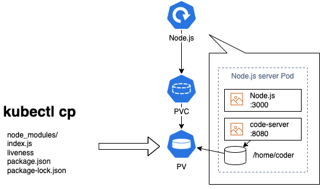
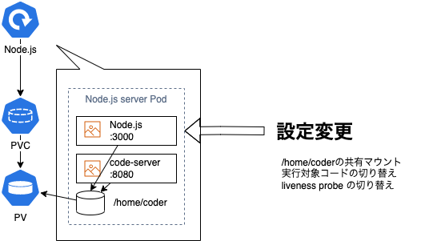

# code-server で in-Cluster ＆ in-Pod な Kubernetes のマイクロサービス開発スタイルを実現する(2/2)

kubernetes TelePresence Remote-Containers code-server VSCode

# code-server とは？

- ひとことで言うと、ブラウザ上で実行できる VS Code です。
  - 参照：[github.com/coder/code-server](https://github.com/coder/code-server)
- 通常の VS Code と完全に同じものではありませんが、ほぼ遜色なく使えます。
- 過去記事もご参照ください。
  - [code-server on EC2 で開発 PC のスペック不足を解消する](../code-server-on-ec2/code-server-on-ec2.md)
  - [code-server で in-Cluster ＆ in-Pod な Kubernetes のマイクロサービス開発スタイルを実現する(1/2)](code-server-on-kubernetes-part1.md)
- 今回は、上記の続きとして、code-server の in-Pod な活用方法について、ご紹介しようと思います。

  

# code-server in-Pod の概念検証マニフェスト例

- [前回]()お伝えした、code-server サイドカー方式のアイデアを検証するために作成したマニフェストは下記の通りです。

`code-server-sidecar.yaml:`

```
apiVersion: apps/v1
kind: Deployment
metadata:
  name: nodeapp
  namespace: default
  labels:
    app.kubernetes.io/instance: nodeapp
    app.kubernetes.io/name: nodeapp
spec:
  replicas: 1
  strategy:
    type: Recreate
  selector:
    matchLabels:
      app.kubernetes.io/instance: nodeapp
      app.kubernetes.io/name: nodeapp
  template:
    metadata:
      labels:
        app.kubernetes.io/instance: nodeapp
        app.kubernetes.io/name: nodeapp
    spec:
      initContainers:
      - name: init-chmod-data
        command:
        - sh
        - -c
        - |
          chown -R 1000:1000 /home/coder
        image: busybox:latest
        imagePullPolicy: IfNotPresent
        resources: {}
        securityContext:
          runAsUser: 0
        terminationMessagePath: /dev/termination-log
        terminationMessagePolicy: File
        volumeMounts:
        - mountPath: /home/coder
          name: data
      # - name: init-liveness
      #   command:
      #   - touch
      #   - /home/coder/liveness
      #   image: busybox:latest
      #   volumeMounts:
      #   - mountPath: /home/coder
      #     name: data
      containers:
      - name: nodeapp
        image: node:16.14.2-bullseye
        imagePullPolicy: IfNotPresent
      #   args:
      #     - /home/coder/index.js
        ports:
        - name: http
          protocol: TCP
          containerPort: 3000
      #   livenessProbe:
      #     exec:
      #       command:
      #       - cat
      #       - /home/coder/liveness
      #     initialDelaySeconds: 10 #Default 0
      #     periodSeconds: 2 #Default 10
      #     timeoutSeconds: 1 #Default 1
      #     successThreshold: 1 #Default 1
      #     failureThreshold: 3 #Default 3
      #   volumeMounts:
      #   - mountPath: /home/coder
      #     name: data
      - name: code-server
        image: codercom/code-server:4.2.0
        imagePullPolicy: IfNotPresent
        env:
        - name: PASSWORD
          value: CodeServerIsAwesome
        ports:
        - name: http
          protocol: TCP
          containerPort: 8080
        livenessProbe:
          failureThreshold: 3
          httpGet:
            path: /
            port: http
            scheme: HTTP
          initialDelaySeconds: 30 #Default 0
          periodSeconds: 10
          successThreshold: 1
          timeoutSeconds: 1
        readinessProbe:
          failureThreshold: 3
          httpGet:
            path: /
            port: http
            scheme: HTTP
          initialDelaySeconds: 30 #Default 0
          periodSeconds: 10
          successThreshold: 1
          timeoutSeconds: 1
        resources: {}
        securityContext:
          runAsUser: 1000
        terminationMessagePath: /dev/termination-log
        terminationMessagePolicy: File
        volumeMounts:
        - mountPath: /home/coder
          name: data
      restartPolicy: Always
      securityContext:
        fsGroup: 1000
      terminationGracePeriodSeconds: 30
      volumes:
      - name: data
        persistentVolumeClaim:
          claimName: code-server
---
apiVersion: v1
kind: PersistentVolumeClaim
metadata:
  name: code-server
  labels:
    app.kubernetes.io/instance: code-server
    app.kubernetes.io/name: code-server
spec:
  storageClassName: hostpath
  volumeMode: Filesystem
  accessModes:
    - ReadWriteOnce
  resources:
    requests:
      storage: 100Mi
```

- 主要な部分は code-server 自身の helm チャートから抽出したものです。
- 上記の例では、Node.js アプリケーションを作る時のことをイメージして、Node.js をメインコンテナとして追加し、code-server のボリュームを共有マウントさせています。
- また、前述したメインコンテナを再起動させる仕組みとして、liveness probe を加えています。

# code-server サイドカー構成のセットアップ手順

前述のマニフェスト例を使って、code-server サイドカーによるマイクロサービス開発用 Pod を起動する手順は下記の通りです。

1. まず最初に、前述のマニフェスト例のコメントアウト部分をそのままにして`kubectl apply`します。しばらく経つと、Node.js コンテナはエラーを繰り返し、`CrashLoopBackOff` になりますが、code-server は起動します。このため、とりあえず Pod は`1/2 CrashLoopBackOff` と `1/2 NotReady` を繰り返す状態になります。
1. この状態でも code-server は起動していますので、`kubectl port-forward (Pod名) 8080:8080` し、ブラウザで `localhost:8080` を開いて code-server を開きます。
1. code-server を開いたら、とりあえずのアプリケーションコードを用意します。アプリケーション資材を `kubectl cp` コマンドを使って `/home/coder` ディレクトリ配下に送り込んでもよいですし、code-server 上でゼロから作成しても構いません。

   

1. この時、code-server には、PersistentVolumeClaim を持たせていますので、仮に Pod が終了しても開発するコードが消えてしまわないようにしています。ゼロから作成する場合は、code-server のターミナルで、例として下記のコマンドを実行します。

   ```
   sudo apt update

   curl -sL https://deb.nodesource.com/setup_16.x | sudo bash -

   sudo apt install -y nodejs npm

   npm install -y express

   cat << EOF > index.js
   const express = require("express");
   const app = express();
   const port = process.env.PORT || 3000;

   app.get("/", (req, res) => {
     res.json({
       message: "Hello code-server sidecar in Pod!",
       localAddress: req.connection.localAddress,
     });
   });

   app.listen(port, () => console.log('Sample app listening on port ${port}!'));
   EOF

   touch liveness
   ```

1. 上記でメインコンテナが実行するコードの準備ができたら、今度はコメントアウト部分を外して `kubectl apply` し、メインコンテナからも code-server の PersistentVolume を共有マウントさせるようにします。同時に、code-server の `/home/coder/` 配下のアプリケーションプログラム資材（ `src/index.js` など）を実行対象にするように切り替えます。さらに、アプリケーション実行プロセスの再起動を可能にするため、`liveness` ファイルの存在をチェックする、liveness probe も導入します。

   

1. しばらくして Pod が `2/2 Running` の状態になったら、セットアップ完了です。これで、code-server で編集可能な `/home/coder/` 配下のコードを実行する Node.js サーバーが起動し、`/home/coder/liveness` ファイルの有無を通じて Node.js を再起動させることも可能になりました。

# code-server サイドカーを実際に動かしてみるとどうなるのか？

- code-server サイドカー方式の実現性を簡単に確認したいため、まずは Docker Desktop の Kubernetes 機能を使って確認してみました。下記がその時の実行結果です。


1. はじめに、Pod の :8080 ポートに `kubectl port-forward` して、code-server を表示させます。

1. 次に Node.js プログラムをちょっと編集して、出力メッセージが変わるようにしてみます。上図の例では、`Hello code-server sidecar in Pod!` を `Hello code-server sidecar in Pod! rv2` に変えています。

1. 次に、Node.js サーバを再起動させるために、liveness probe に設定した liveness ファイルを削除してみます。すぐに liveness probe が検知して、Node.js サーバのコンテナを再起動させるはずです。

1. 数秒経って、liveness probe が検知した様子が確認できたら、liveness ファイルを再作成して、再起動した Node.js サーバが再び再起動されないようにしておきます。

1. Node.js サーバコンテナが LISTEN する、:3000 ポートを叩いてみます。まだ再起動が完了していなかったので、接続エラーになりました。

1. もう少し時間を置いて再度、:3000 ポートを叩いてみます。今度は期待通り、出力されるメッセージが `Hello code-server sidecar in Pod! rv2` に変わったことが確認できました。

1. これで、in-Pod な code-server サイドカーを使って、アプリケーションプログラムを開発・修正し、アプリケーションを再起動できることが確認できました。最初に、何のアプリケーションコードも持たない、プレーンな Node.js コンテナをデプロイしている点に注目しましょう。アプリケーションコードがゼロの状態から Pod 上で開発を始めたことになります。

# 他の方法と比較してどうか？

code-server による in-Cluster & in-Pod な開発スタイルは、よくできた、すでにある他の方法を使った開発スタイルと比較してどうなのでしょうか？使っていく価値はあるのでしょうか？まずは違いを見ていきたいと思います。

## VSCode の`Remote - Containers` と `Kubernetes` 拡張機能を使って Kubernetes の Pod をデバッグする

- 今回の code-server の in-Cluster & in-Pod な開発スタイルと目的が似た方法として、通常の VS Code による、Kubernetes の Pod へのアタッチ機能があるかと思います。
- これは、Kubernetes の Pod に VSCode をアタッチさせてデバッグしたり、ファイルを開いたりすることができる機能で、`Remote - Containers` 拡張機能と `Kubernetes` 拡張機能の組み合わせでできます。GUI 操作のみで Pod にアタッチできて便利です。
- この仕組みは、アタッチする時に Pod に vscode-server を送り込み、Pod の中で起動させることで実現されているようです。
- VS Code の方は必要が生じた際に vscode-server を送り込んでデバッグする方式、code-server の in-Cluster & in-Pod な開発スタイルの方は、最初からデバッグしたい対象に送り込んでおいて、そこで開発する方式、と言えるかと思います。

## Telepresence を使って、ローカルで起動したアプリケーションへ通信を転送させる

- Telepresence はローカルで起動したアプリケーションの方に、Kubernetes クラスタ上に立ち上げた、アプリケーションのプロキシとなる Deployment と通信し、リクエストを転送してもらって応答したり、自分が発したリクエストを Kubernetes クラスタ内で再現してもらったりする仕組みと言えます。いわば、ローカルの方がマスターです。
- 逆に今回の code-server による in-Cluster & in-Pod な開発スタイルは、リモートにある Kubernetes クラスタ内の Pod の方がマスターで、そこに開発環境を持っていくようなイメージの方式です。

## それぞれのメリット・デメリット

- VS Code のアタッチ機能も Telepresence も、伝統的なリモートデバッグ方式の発想の延長として、どちらもローカルの IDE を主とした方式と言えます。逆に code-server による in-Cluster & in-Pod な活用方法の方は、リモートに IDE を持っていくようなイメージで、IDE Anywhere な発想の方式かと思います。
- 実際のところ、今回は code-server による in-Cluster & in-Pod な開発スタイルの概念検証をしたまでですので、まだまだ比較に足るものとは言えないでしょう。
- ですが、もう少し code-server による in-Cluster & in-Pod な開発スタイルを深掘りすると、それぞれのメリット・デメリットが出てきて、面白そうです。また、code-server ならではのメリットも出てきそうな気がします。
- code-server を in-Cluster & in-Pod に使う、という方式にちょっとした夢を感じますので、今後、もう少し深堀っていきたいと思います。実務でも機会があれば、code-server を活用した、Kunernetes の in-Cluster & in-Pod なマイクロサービス開発スタイルを実践してみた結果についても報告したいと思います。

# まとめ

- code-server を使うことで、Kubernetes クラスタの中で、ゼロの状態からマイクロサービス開発を始められることが確認できました。
- Kubernetes 上の in-Cluster & in-Pod な開発・デバッグ スタイルは、開発の進め方を大きく変える可能性を持っています。
- ちょっとでも可能性を感じた方は、ご自身でも試してみて、評価してみると面白いかもしれません。

# 記事の続き

内容の続きは、こちらの記事「[Kubernetes 上の code-server で Pod やメインコンテナにアタッチしてデバッグする](code-server-on-kubernetes-debug.md)」をご参照ください。
