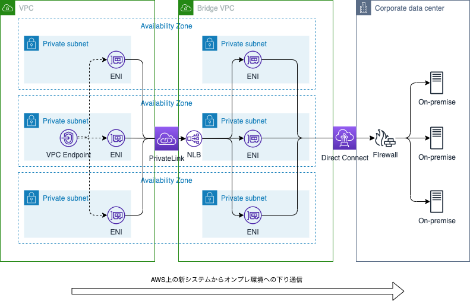
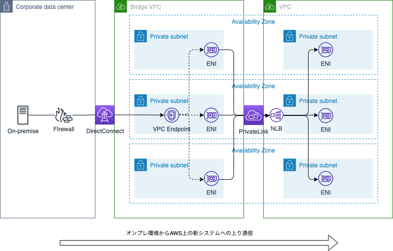
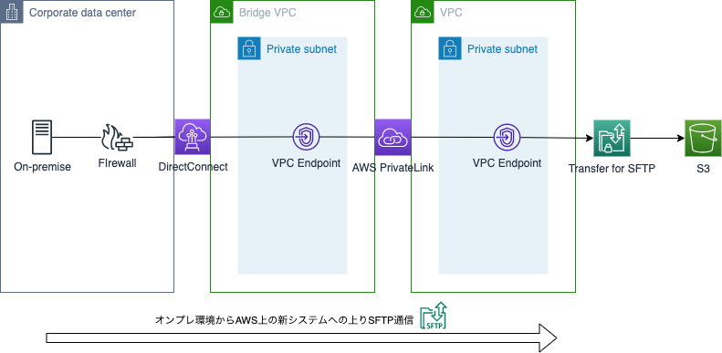

# オンプレのプライベート IP 足りない問題を PrivateLink で解決する（後編）

Tags: PrivateLink, AWS, NAT

オンプレのプライベート IP 足りない問題についてと、PrivateLink の基本的な特徴については、[前編](private-address-shortage-part1.md) を参照してください。

# なぜプライベート IP 足りない問題への対策になるのか？

- オンプレ環境からは、AWS 上の新システムと通信する際に、ルーティング上、直接通信するのが各図の真ん中にある、ブリッジ VPC のみになるためです。
- オンプレ環境からは、PrivateLink の向こうにある、新システム用の VPC に割り当てたプライベート IP レンジについては不可視になります。
- PrivateLink は主に NLB を使用するため、基本的に各 AZ ごとの ENI に 1IP ずつしか使いません。
- さらに、PrivateLink では、インターフェースエンドポイントのポートごとに NAPT 通信先になるシステムを設定できるため、1 本の PrivateLink で多数の連携先システムに対応できます。
- このため、上り方向と下り方向で 2 本の PrivateLink を設置し、後ほど本数を増やすことになった時のことを考慮しても、ブリッジ VPC に割り当てる必要があるのは、十分に小さいプライベート IP レンジで済むことになります。

  - AWS 上の新システムからオンプレ環境への下り通信時の例：

    

  - オンプレ環境から AWS 上の新システムへの上り通信時の例：

    

# PrivateLink を使ってよかった点

- 数年前に筆者が直接経験した案件では、オンプレ環境にある、3 桁に上るシステム群と AWS 上の新システムを通信させる必要が生じました。

  このため、他の方法を用いていた時の NAT ルールの追加時や試験、メンテナンスなどの手間を想像すると、PrivateLink を使って良かったと思いました。

  マネージドサービスである PrivateLink を使うことで、通信元サーバー群のセキュリティグループの定義と、通信先となるシステムの IP とポートの管理に集中することができました。

- PrivateLink のインターフェースエンドポイントには、セキュリティグループを付与できます。このため、特定のセキュリティグループの定義をいじるだけで、特定のシステム（≒ 特定のポート）だけ、一時的に PrivateLink 越しの通信を遮断する、といった使い方もできます。

  これを活用すると、例えば性能試験時に、あらかじめ特定の通信経路を遮断しておくことで、無関係なシステムに負荷をかけてしまわないことを保証する、などといった使い方ができ、便利でした。

- また、オンプレ側のシステムから、SFTP でファイル転送を受け付ける要件が発生した際も、PrivateLink 越しに Transfer for SFTP の VPC エンドポイントをつなぐことができたため、拡張性の低いブリッジ VPC 内に SFTP サーバを立てることを避けられ、対応が容易でした。

  

# オンプレ環境との NAT 通信に PrivateLink を使う上で気をつけるべき点

## 発信元 IP によって呼び出し元を区別できない

- 例えば、AWS → オンプレへの下り方向の通信の際、AWS 側のシステムに、発信元となるサブシステムが複数あったとしても、オンプレ側のシステムから見ると、発信元 IP は、皆同じになってしまいます。

- これは、呼び出し元となる AWS 側のサブシステムに関係なく、下り通信の出口となる、各 AZ ごとの ENI の IP 群に発信元が集約されてしまうためです。

- このため、オンプレ側のシステムは、発信元の IP によって、呼び出し元となる AWS 側のサブシステムを区別できない、といった点に注意が必要です。

- 必要性に応じて、発信元となるサブシステムごとに下り方向の PrivateLink を設ける、といった対策についても検討が必要です。

- また、これは上りと下りの方向を逆にしても同じことが言えるため、AWS 側のシステムから見ると、発信元 IP でオンプレ側のシステムを区別することはできない、と言う点にも注意が必要です。

## 各プロトコルのデフォルトポートが使えない場合が出てくる

- PrivateLink は インターフェースエンドポイントのポートごとに NAPT 通信先のシステムを設定する仕組み、だと言えますので、例えば、連携先システム A との SFTP 通信のために 22 番ポートを使うことにしたとしますと、連携先システム B との SSH 通信のためには、別のポートを割り当てる必要が出てきます。

  クライアントアプリケーション側の設定で、呼び出し先ポートを変更できれば問題ありませんが、これが諸般の事情で難しい場合、別にもう 1 本 PrivateLink を立てる、などの対応を検討する必要が出てきます。

## PrivateLink 越しに通信できないプロトコルがある

- 例えば、NLB 自体は UDP 通信に対応していますが、PrivateLink として使われる NLB の場合、UDP 通信は対応されていません。このため、これまで UDP で通信してきたプロトコルについては、UDP のままでは PrivateLink 越しに通信できないことになります。

  このため、TCP での通信も可能なプロトコルの場合は、TCP での通信に切り替える、などの検討や対応が必要になります。

  - 参考リンク

    https://aws.amazon.com/jp/elasticloadbalancing/faqs/

    > Q: Network Load Balancer を使用して AWS PrivateLink を設定できますか?

    > A: はい。TCP および TLS リスナーを使用する Network Load Balancer を使用して、AWS PrivateLink を設定できます。Network Load Balancer の UDP リスナーを使用して PrivateLink を設定することはできません。

  - 参考リンク

    https://docs.aws.amazon.com/ja_jp/vpc/latest/privatelink/vpce-interface.html

    > インターフェイスエンドポイントは TCP トラフィックのみをサポートします。

## PrivateLink 越しでも一応通信はできるが、実際には現実的でないプロトコルが存在する

- 例えば FTP プロトコルなどです。

  そもそも FTP で通信することは、さすがにもうないのでは？と思ってしまいますが、実際に要件として検討を依頼された経験もあり、オンプレ側の歴史ある既存システムの都合で、FTP のような古いプロトコルの使用を変えにくい事情がある場合などは注意が必要になります。

  まず、アクティブモードでは FTP サーバからクライアントに対して、データ通信用の折り返し接続が必要になるため、PrivateLink 越しには通信できません。

  では、パッシブモードなら可能では？と一瞬思えますが、データ通信用接続に使用するポートのレンジを狭く設定できること（でないと PrivateLink のポートが足りなくなります）や、FTP サーバがクライアントに返す IP アドレスを PrivateLink で NAT された IP に変えて返信できること、また、それらの FTP サーバの設定に合わせて FTP クライアント側が動作すること、などの確認が必要になります。

  このため、FTP の場合は「よかった点」にもありますように、SFTP などに変更し、AWS Transfer for SFTP などの利用を考える方が現実的だと言えます。

## NLB によるヘルスチェック頻度が意外に高いことに注意

- PrivateLink として使われる NLB の場合、TCP ヘルスチェックの実行頻度などの設定を変えることができない仕様になっているのですが、これが意外に実行頻度が高く、場合によってはヘルスチェックを受けるオンプレ側のシステムの負担になってしまうことがあるため、注意が必要です。

## 通信先の数が多いと、PrivateLink の本数が片道 1 本では足りなくなる場合がある

- 連携先システムの数が多いと、出口 NLB の制限に引っかかりやすくなりますので注意が必要です。筆者が経験した案件では、最終的に連携先システムの数が 3 桁に上ったため、片道 1 本では足りなくなり、途中で増設することになりました。

- 参考リンク:

  https://docs.aws.amazon.com/ja_jp/elasticloadbalancing/latest/network/load-balancer-limits.html

  > Network Load Balancer あたりのリスナー　デフォルト：50 　調整可能：いいえ

# まとめ

- 歴史ある大企業などでは、オンプレから AWS 上の新システムに払い出すプライベート IP レンジが不足する問題が起こり得ます。
- そんな時、マネージドサービスである PrivateLink は救世主になり得ます。
- 便利な PrivateLink ですが、気をつけるべき点もあるので、過信して軽く見ず、大きなシステムでの利用に対しては、よく検討してから使うようにしましょう。

[前編](private-address-shortage-part1.md) へ戻る
